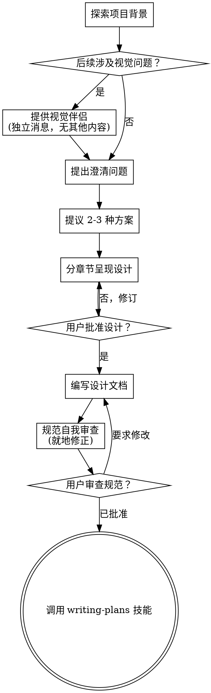

# 从创意到设计的头脑风暴 (Brainstorming)

通过自然的协作对话，帮助将创意转化为成熟的设计和规范。

首先了解当前项目背景，然后一次提一个问题来微调创意。一旦你理解了要构建的内容，就呈现设计并获得用户批准。

<HARD-GATE>
在呈现设计并获得用户批准之前，**严禁**调用任何实现技能、编写任何代码、搭建任何项目或采取任何实现动作。这适用于**所有**项目，无论其看起来多么简单。
</HARD-GATE>

## 反面模式：“这太简单了，不需要设计”

每个项目都要经过这个过程。无论是待办事项列表、单功能实用程序，还是配置更改 —— 统统都要。在“简单”的项目中，未经审查的假设往往会导致最多的无效工作。设计可以很简短（对于真正简单的项目只需几句话），但你**必须**呈现它并获得批准。

## 检查清单 (Checklist)

你**必须**为以下每一项创建一个任务，并按顺序完成它们：

1. **探索项目背景** —— 检查文件、文档、最近的提交。
2. **提供视觉伴侣 (Visual Companion)**（如果主题涉及视觉问题） —— 这是一个独立的消息，不与澄清问题合并。见下文“视觉伴侣”部分。
3. **提出澄清问题** —— 一次一个，了解目的、约束、成功标准。
4. **提议 2-3 种方案** —— 权衡利弊并提供你的建议。
5. **呈现设计** —— 根据复杂度分章节呈现，每章完成后获取用户批准。
6. **编写设计文档** —— 保存至 `docs/superpowers/specs/YYYY-MM-DD-<主题>-design.md` 并提交代码。
7. **规范自我审查** —— 快速检查占位符、矛盾点、歧义和范围（见下文）。
8. **用户审查书面规范** —— 在继续之前请用户审查规范文件。
9. **过渡到实现** —— 调用 writing-plans 技能来创建实施计划。

## 流程图

**终点状态是调用 writing-plans。** 不要调用 frontend-design、mcp-builder 或任何其他实现技能。头脑风暴后你调用的**唯一**技能是 writing-plans。

## 流程细节

**理解创意：**

- 首先查看当前项目状态（文件、文档、最近的提交）。
- 在提出详细问题之前，评估范围：如果请求描述了多个独立的子系统（例如，“构建一个带有聊天、文件存储、计费和分析的平台”），请立即标记。不要把时间花在细化一个需要先进行拆分的项目细节上。
- 如果项目对于单个规范来说太大，帮助用户进行拆分：有哪些独立的部分，它们如何关联，应该按什么顺序构建？然后按正常设计流程对第一个子项目进行头脑风暴。每个子项目都有自己的“规范 → 计划 → 实现”循环。
- 对于范围适中的项目，一次提一个问题来微调创意。
- 尽可能优先使用多选题，但开放式问题也可以。
- 每条消息只提一个问题 —— 如果一个话题需要更多探索，将其拆分为多个问题。
- 重点在于理解：目的、约束、成功标准。

**探索方案：**

- 提议 2-3 种不同的方案并权衡利弊。
- 以对话方式呈现选项，并给出你的建议和理由。
- 以你推荐的选项开头并解释原因。

**呈现设计：**

- 一旦你认为理解了要构建的内容，就呈现设计。
- 根据复杂度调整每部分的大小：简单的用几句话，复杂的用 200-300 字。
- 每节结束后询问目前看起来是否正确。
- 涵盖：架构、组件、数据流、错误处理、测试。
- 准备好在出现不明白的地方时回过头去确认。

**隔离与清晰度设计：**

- 将系统拆分为更小的单元，每个单元都有一个清晰的目的，通过明确定义的接口进行通信，并且可以独立理解和测试。
- 对于每个单元，你应该能够回答：它做什么，如何使用它，以及它依赖什么？
- 是否有人可以在不阅读内部实现的情况下理解一个单元的功能？你能在不破坏消费端的情况下更改内部实现吗？如果不能，边界就需要调整。
- 较小、边界良好的单元也更易于你工作 —— 当你可以同时将代码保留在上下文中时，你的推理逻辑最强，且当文件焦点集中时，你的编辑更可靠。当一个文件变得很大时，这通常是它做得太多的信号。

**在现有代码库中工作：**

- 在提议更改之前探索当前结构。遵循既有的模式。
- 如果现有代码存在影响工作的问题（例如，文件变得太大、边界不清晰、责任混乱），将针对性的改进作为设计的一部分 —— 就像好的开发者改进他们正在编写的代码一样。
- 不要提议无关的重构。专注于服务于当前目标的内容。

## 设计完成之后

**文档化：**

- 将验证后的设计（规范）写入 `docs/superpowers/specs/YYYY-MM-DD-<主题>-design.md`。
  - （用户对规范存放位置的偏好将覆盖此默认设置）
- 如果可用，使用 elements-of-style:writing-clearly-and-concisely 技能。
- 将设计文档提交到 git。

**规范自我审查：**
在编写完规范文档后，用全新的眼光审视它：

1. **占位符扫描：** 是否有 "TBD"、"TODO"、未完成的部分或模糊的要求？修正它们。
2. **内部一致性：** 任何部分是否互相矛盾？架构是否匹配功能描述？
3. **范围检查：** 它是否足够专注以用于单个实施计划，还是需要拆分？
4. **歧义检查：** 任何要求是否可能有两种不同的解释？如果是，选择一种并明确说明。

就地修正任何问题。无需重新审查 —— 修正并继续即可。

**用户审查关卡：**
在规范审查循环通过后，请用户在继续之前审查书面规范：

> “规范已编写并提交至 `<路径>`。请查看一下，在开始编写实施计划之前，告诉我是否需要进行任何更改。”

等待用户的回复。如果他们要求更改，请进行修改并重新运行规范审查循环。只有在用户批准后才能继续。

**实现：**

- 调用 writing-plans 技能来创建详细的实施计划。
- 不要调用任何其他技能。writing-plans 是下一步。

## 关键原则

- **一次只提一个问题** —— 不要用多个问题轰炸用户。
- **优先使用多选题** —— 相比开放式问题，多选题更容易回答。
- **冷酷地推行 YAGNI** —— 从所有设计中移除不必要的功能。
- **探索备选方案** —— 在确定方案之前，始终提议 2-3 种方法。
- **增量验证** —— 呈现设计，并在继续之前获得批准。
- **保持灵活** —— 当出现不明白的地方时，回过头去澄清。

## 视觉伴侣 (Visual Companion)

一个基于浏览器的伴侣工具，用于在头脑风暴期间展示原型、图表和视觉选项。作为工具使用 —— 而非模式。接受伴侣意味着它可用于受益于视觉处理的问题；这并不意味着每个问题都要通过浏览器。

**提供伴侣建议：** 当你预见到接下来的问题将涉及视觉内容（原型、布局、图表）时，提议一次以获得同意：
> “如果我能在 Web 浏览器中向你展示，我们正在处理的一些内容可能会更容易解释。我可以在进行过程中准备原型、图表、对比图和其他视觉效果。这项功能相对较新，可能会消耗较多 token。想尝试一下吗？（需要打开一个本地 URL）”

**这一提议必须作为独立消息发送。** 不要将其与澄清问题、背景总结或任何其他内容合并。该消息应仅包含上述提议，别无他法。在继续之前等待用户的回复。如果被拒绝，则继续进行仅限文本的头脑风暴。

**针对每个问题的决策：** 即使在用户接受后，也要针对每个问题决定是使用浏览器还是终端。测试标准是：**用户看图是否比读文字更容易理解？**

- **对视觉内容使用浏览器** —— 原型、线框图、布局对比、架构图、并排视觉设计。
- **对文本内容使用终端** —— 需求问题、概念选择、权衡清单、A/B/C/D 文本选项、范围决策。

有关 UI 主题的问题并不自动等同于视觉问题。“在这种语境下个性意味着什么？”是一个概念性问题 —— 使用终端。“哪种向导布局效果更好？”是一个视觉问题 —— 使用浏览器。

如果他们同意使用视觉伴侣，请在继续之前阅读详细指南：
`skills/brainstorming/visual-companion.md`
