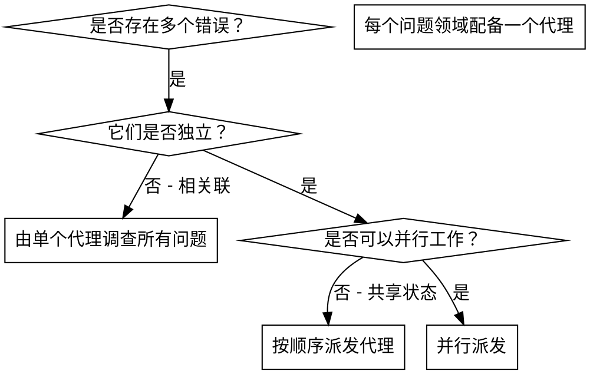

# 派发并行代理 (Dispatching Parallel Agents)

## 概览

你将任务委派给具有隔离上下文的专业化代理。通过精确构建它们的指令和上下文，可以确保它们专注于任务并取得成功。它们不应继承你当前会话的上下文或历史记录 —— 你要准确构建它们所需的一切。这也能为你自己的协调工作保留上下文。

当你遇到多个互不相关的错误（不同的测试文件、不同的子系统、不同的漏洞）时，按顺序调查它们会浪费时间。每项调查都是独立的，可以并行进行。

**核心原则：** 为每个独立的问题领域派发一个代理。让它们并发工作。

## 何时使用



**在以下情况下使用：**
- 3 个以上测试文件报错，且根本原因各不相同。
- 多个子系统独立损坏。
- 每个问题都可以在不了解其他问题背景的情况下被理解。
- 各项调查之间不存在共享状态。

**不要在以下情况下使用：**
- 故障是相关联的（修复一个可能会修复其他）。
- 需要理解完整的系统状态。
- 代理之间会互相干扰。

## 实施流程

### 1. 识别独立领域

按故障类型对错误进行分组：
- 文件 A 测试：工具审批流
- 文件 B 测试：批量完成行为
- 文件 C 测试：中止（Abort）功能

每个领域都是独立的 —— 修复工具审批逻辑不会影响中止功能的测试。

### 2. 创建专注的代理任务

每个代理获得：
- **具体范围：** 一个测试文件或子系统。
- **明确目标：** 使这些测试通过。
- **约束：** 不要更改其他代码。
- **预期输出：** 你发现并修复内容的摘要。

### 3. 并行派发

```typescript
// 在 Claude Code / AI 环境中
Task("修复 agent-tool-abort.test.ts 的失败项目")
Task("修复 batch-completion-behavior.test.ts 的失败项目")
Task("修复 tool-approval-race-conditions.test.ts 的失败项目")
// 这三个任务将并发运行
```

### 4. 审查与集成

当代理向回报告时：
- 阅读每份摘要。
- 验证修复方案是否互不冲突。
- 运行完整的测试套件。
- 集成所有更改。

## 代理提示词结构

优秀的代理提示词应当：
1. **专注** —— 一个清晰的问题领域。
2. **自洽** —— 包含理解问题所需的所有上下文。
3. **明确输出要求** —— 代理应当返回什么？

```markdown
修复 src/agents/agent-tool-abort.test.ts 中的 3 个失败测试：

1. "should abort tool with partial output capture" —— 消息中应包含 'interrupted at'。
2. "should handle mixed completed and aborted tools" —— 快速工具被中止而非完成。
3. "should properly track pendingToolCount" —— 预期有 3 个结果但得到了 0。

这些是时间/竞争条件问题。你的任务：

1. 阅读测试文件并理解每个测试验证的内容。
2. 识别根本原因 —— 是时间问题还是实际的 bug？
3. 进行修复：
   - 用基于事件的等待替换随意的超时。
   - 如果发现中止功能的实现存在 bug，请予以修复。
   - 如果测试的是已变更的行为，请调整测试预期。

严禁仅仅增加超时时间 —— 请找到真正的问题所在。

返回：你发现的内容及修复内容的摘要。
```

## 常见错误

**❌ 过于宽泛：** “修复所有测试” —— 代理会迷失方向。
**✅ 具体准确：** “修复 agent-tool-abort.test.ts” —— 范围专注。

**❌ 缺失上下文：** “修复竞争条件” —— 代理不知道在哪里修复。
**✅ 提供上下文：** 粘贴错误消息和测试名称。

**❌ 无约束条件：** 代理可能会重构所有内容。
**✅ 设定约束：** “不要更改生产代码”或“仅修复测试代码”。

**❌ 输出模糊：** “修好了” —— 你不知道改了什么。
**✅ 明确输出：** “返回根本原因和变更摘要”。

## 何时不要使用

- **相关联的故障：** 修复一个可能会修复其他 —— 请先整体调查。
- **需要全局上下文：** 理解问题需要查看整个系统。
- **探索性调试：** 你还不知道哪里坏了。
- **共享状态：** 代理会互相干扰（编辑同一个文件，使用同一个资源）。

## 会话真实案例

**场景：** 经过大规模重构后，3 个文件中共出现 6 个测试失败。

**故障详情：**
- agent-tool-abort.test.ts: 3 个失败（时间问题）
- batch-completion-behavior.test.ts: 2 个失败（工具未执行）
- tool-approval-race-conditions.test.ts: 1 个失败（执行次数 = 0）

**决策：** 独立领域 —— 中止逻辑、批量完成逻辑和竞争条件分别属于互不干扰的部分。

**派发：**
```
代理 1 → 修复 agent-tool-abort.test.ts
代理 2 → 修复 batch-completion-behavior.test.ts
代理 3 → 修复 tool-approval-race-conditions.test.ts
```

**结果：**
- 代理 1：用基于事件的等待替换了超时。
- 代理 2：修复了事件结构漏洞（threadId 位置错误）。
- 代理 3：添加了对异步工具执行完成的等待逻辑。

**集成：** 所有修复均独立完成，无冲突，全套件测试通过（Green）。

**节省时间：** 并行解决 3 个问题，而非串行。

## 核心优势

1. **并行化** —— 多项调查同时进行。
2. **专注度** —— 每个代理范围更窄，需要跟踪的上下文更少。
3. **独立性** —— 代理互不干扰。
4. **速度** —— 用解决 1 个问题的时间解决了 3 个。

## 验证工作

代理向回报告后：
1. **审查每份摘要** —— 理解改动了什么。
2. **检查冲突** —— 代理是否编辑了相同的代码？
3. **运行全套件测试** —— 验证所有修复能协同工作。
4. **随机抽查** —— 代理可能会犯系统性错误。

## 实际影响

来自某次调试会话 (2025-10-03)：
- 3 个文件中出现 6 个失败。
- 并行派发了 3 个代理。
- 所有调查同时完成。
- 所有修复均成功集成。
- 代理的变更之间零冲突。
