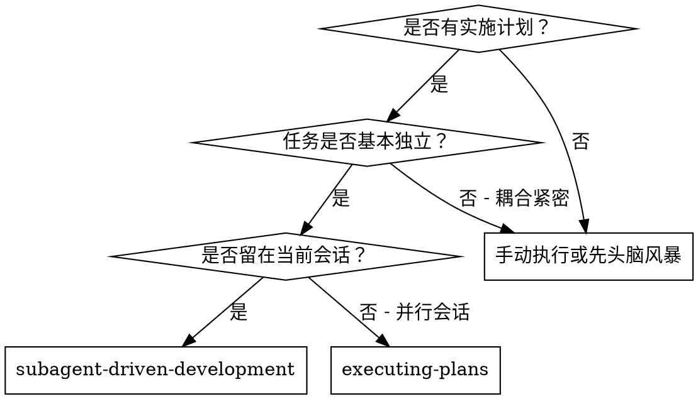
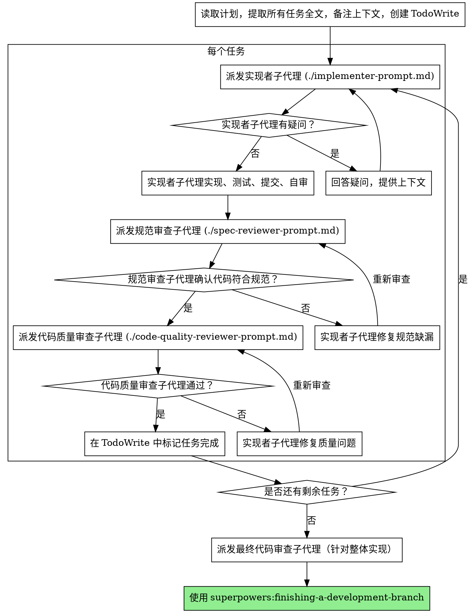

# 子代理驱动开发 (Subagent-Driven Development)

通过为每个任务派发一个新鲜的子代理（subagent）来执行计划，并在每个任务结束后进行两阶段审查：首先是规范合规性审查，然后是代码质量审查。

**为什么要用子代理：** 你将任务委派给具有隔离上下文的专业化代理。通过精确构建它们的指令和上下文，可以确保它们专注于任务并取得成功。它们不应继承你当前会话的上下文或历史记录 —— 你要准确构建它们所需的一切。这也能为你自己的协调工作保留上下文。

**核心原则：** 每个任务配备新鲜子代理 + 两阶段审查（规范 + 质量）= 高质量、快速迭代。

## 何时使用



**对比 执行计划 (executing-plans)（并行会话）：**
- 同一会话（无上下文切换）
- 每个任务配备新鲜子代理（无上下文污染）
- 每个任务后的两阶段审查：先审规范合规，再审代码质量
- 更快的迭代速度（任务之间无需人工接入）

## 流程细节



## 模型选择

使用能够胜任该角色的最轻量级模型，以节省成本并提高速度。

**机械性实现任务**（隔离的函数、清晰的规范、涉及 1-2 个文件）：使用快速且廉价的模型。如果计划制定得当，大多数实现任务都是机械性的。

**集成与判断任务**（多文件协调、模式匹配、调试）：使用标准模型。

**架构、设计及审查任务**：使用可用的最强大模型。

**任务复杂度判定信号：**
- 涉及 1-2 个文件且规范完整 ——> 廉价模型
- 涉及多个文件且存在集成顾虑 ——> 标准模型
- 需要设计判断或广泛的代码库理解 ——> 最强大模型

## 处理实现者状态

实现者子代理会报告四种状态之一。请妥善处理：

**DONE (完成):** 进入规范合规性审查。

**DONE_WITH_CONCERNS (完成但有顾虑):** 实现者完成了工作，但标记了疑虑。在继续之前阅读这些顾虑。如果顾虑关乎正确性或范围，请在审查前解决。如果是观察性结论（例如，“这个文件变得很大”），请备注并继续审查。

**NEEDS_CONTEXT (需要上下文):** 实现者需要未提供的信息。提供缺失的上下文并重新派发。

**BLOCKED (已阻塞):** 实现者无法完成任务。评估阻塞原因：
1. 如果是上下文问题，提供更多上下文并使用相同模型重新派发。
2. 如果任务需要更多的推理能力，使用更强大的模型重新派发。
3. 如果任务太大，将其拆分为更小的部分。
4. 如果计划本身有误，升级给人（Human）处理。

**严禁**忽略升级请求，或在不作更改的情况下强迫同一个模型重试。如果实现者说它卡住了，说明有些东西需要改变。

## 提示词模板

- `./implementer-prompt.md` —— 派发实现者子代理
- `./spec-reviewer-prompt.md` —— 派发规范合规审查子代理
- `./code-quality-reviewer-prompt.md` —— 派发代码质量审查子代理

## 示例工作流

```
你：“我正使用‘子代理驱动开发’技能来执行此计划。”

[读取计划文件一次: docs/superpowers/plans/feature-plan.md]
[提取所有 5 个任务及其全文和上下文]
[创建包含所有任务的 TodoWrite]

任务 1: Hook 安装脚本

[获取任务 1 的文本和上下文（已预提取）]
[派发实现子代理，附带任务全文 + 上下文]

实现者：“在我开始之前 —— 钩子（hook）应该安装在用户级别还是系统级别？”

你：“用户级别 (~/.config/superpowers/hooks/)”

实现者：“明白了。正在实现...”
[稍后] 实现者：
  - 实现了 install-hook 命令
  - 添加了测试，5/5 通过
  - 自审：发现漏掉了 --force 标志，已补齐
  - 已提交

[派发规范合规审查员]
规范审查员：✅ 符合规范 —— 满足所有要求，无多余内容

[获取 git SHAs，派发代码质量审查员]
代码审查员：优点：良好的测试覆盖，整洁。问题：无。批准。

[标记任务 1 已完成]

任务 2: 恢复模式 (Recovery modes)

[获取任务 2 的文本和上下文（已预提取）]
[派发实现子代理，附带任务全文 + 上下文]

实现者：[无疑问，继续执行]
实现者：
  - 添加了验证/修复模式
  - 8/8 测试通过
  - 自审：一切正常
  - 已提交

[派发规范合规审查员]
规范审查员：❌ 问题：
  - 缺失点：进度报告（规范要求“每 100 项报告一次”）
  - 多余点：添加了 --json 标志（规范未要求）

[实现者修复问题]
实现者：移除了 --json 标志，添加了进度报告

[规范审查员再次审查]
规范审查员：✅ 现在符合规范了

[派发代码质量审查员]
代码审查员：优点：稳健。问题（重要）：幻数 (Magic number) (100)

[实现者修复]
实现者：提取了 PROGRESS_INTERVAL 常量

[代码审查员再次审查]
代码审查员：✅ 已批准

[标记任务 2 已完成]

...

[完成所有任务后]
[派发最终代码审查员]
最终审查员：满足所有要求，准备合并。

完成！
```

## 优势

**对比 手动执行：**
- 子代理会自然遵循 TDD 原则
- 每个任务都有新鲜的上下文（不会混淆）
- 并行安全（子代理互不干扰）
- 子代理可以提问（在工作开始前和进行中均可）

**对比 执行计划 (executing-plans)：**
- 同一会话（无需交接）
- 进度连续（无需等待）
- 审查检查点自动执行

**效率提升：**
- 无需反复读取文件（控制端提供全文）
- 控制端精确挑选所需的上下文
- 子代理预先获得完整信息
- 在工作开始前就暴露出疑问（而非事后）

**质量关卡：**
- 自审可以在交接前捕捉问题
- 两阶段审查：规范合规，然后是代码质量
- 审查循环确保修复方案真正奏效
- 规范合规审查防止过度构建或构建不足
- 代码质量审查确保实现方案架构良好

## 成本

- 更多的子代理调用（每个任务需 1 个实现者 + 2 个审查者）
- 控制端需要做更多的准备工作（预先提取所有任务）
- 审查循环会增加迭代次数
- 但能提早发现问题（比事后调试更便宜）

## 警示信号 (Red Flags)

**严禁执行以下操作：**
- 在没有经过用户明确同意的情况下，在 main/master 分支上开始实现。
- 跳过审查（规范合规性审查或代码质量审查）。
- 在存在未修复问题的情况下继续进行。
- 同时并行派发多个实现子代理（会导致冲突）。
- 让子代理读取计划文件（应提供全文）。
- 跳过场景设定的上下文（子代理需要理解任务所处的位置）。
- 忽略子代理的问题（在允许它们继续之前请先回答）。
- 在规范合规性上接受“差不多就行了”（规范审查员发现问题 = 未完成）。
- 跳过审查循环（审查员发现问题 = 实现者修复 = 再次审查）。
- 让实现者的自查替代正式审查（两者缺一不可）。
- **在规范合规性获批 ✅ 之前就开始代码质量审查**（顺序错误）。
- 当任一审查环节仍有未决问题时即移至下一个任务。

**如果子代理提出疑问：**
- 给予清晰且完整的回答。
- 如果需要，提供额外的上下文。
- 不要催促它们开始实现。

**如果审查员发现问题：**
- 由实现者（同一个子代理）进行修复。
- 审查员再次进行审查。
- 循环往复直到批准。
- 不要跳过重审步骤。

**如果子代理在任务中失败：**
- 派发一个附带具体指令的修复子代理。
- 不要尝试手动修复（会导致上下文污染）。

## 集成

**要求的工作流技能：**
- **superpowers:using-git-worktrees** —— 要求：在开始之前设置隔离的工作区。
- **superpowers:writing-plans** —— 创建此技能执行的计划。
- **superpowers:requesting-code-review** —— 为审查者子代理提供的代码审查模板。
- **superpowers:finishing-a-development-branch** —— 所有任务完成后完成开发。

**子代理应当使用：**
- **superpowers:test-driven-development** —— 子代理在每个任务中遵循 TDD。

**备选工作流：**
- **superpowers:executing-plans** —— 用于在并行会话而非当前会话执行。
