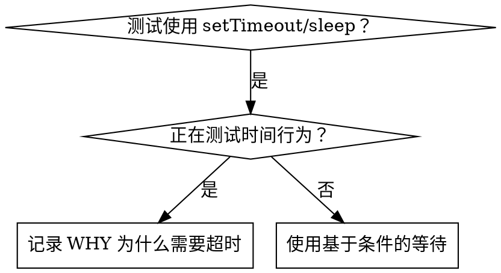

# 基于条件的等待 (Condition-Based Waiting)

## 概览

脆弱（Flaky）的测试通常通过随意的延迟（setTimeout）来猜测时间。这会产生竞争条件，使得测试在高性能机器上通过，但在高负载或 CI（持续集成）环境下失败。

**核心原则：** 等待你真正关心的实际条件，而不是猜测它需要多长时间。

## 何时使用



**在以下情况下使用：**
- 测试包含随意的延迟 (`setTimeout`, `sleep`, `time.sleep()`)。
- 测试不稳定 (有时通过，高负载下失败)。
- 测试在并行运行时超时。
- 等待异步操作完成。

**不要在以下情况下使用：**
- 测试实际的时间行为（如：防抖、节流间隔）。
- 如果必须使用随意的超时，务必记录 **WHY**（原因）。

## 核心模式

```typescript
// ❌ 之前：猜测时间
await new Promise(r => setTimeout(r, 50));
const result = getResult();
expect(result).toBeDefined();

// ✅ 之后：等待条件成立
await waitFor(() => getResult() !== undefined);
const result = getResult();
expect(result).toBeDefined();
```

## 快速模式参考

| 场景 | 模式 |
|----------|---------|
| 等待事件 | `waitFor(() => events.find(e => e.type === 'DONE'))` |
| 等待状态 | `waitFor(() => machine.state === 'ready')` |
| 等待数量 | `waitFor(() => items.length >= 5)` |
| 等待文件 | `waitFor(() => fs.existsSync(path))` |
| 复杂条件 | `waitFor(() => obj.ready && obj.value > 10)` |

## 实现方式

通用轮询函数：
```typescript
async function waitFor<T>(
  condition: () => T | undefined | null | false,
  description: string,
  timeoutMs = 5000
): Promise<T> {
  const startTime = Date.now();

  while (true) {
    const result = condition();
    if (result) return result;

    if (Date.now() - startTime > timeoutMs) {
      throw new Error(`等等待 ${description} 超时，超过 ${timeoutMs}ms`);
    }

    await new Promise(r => setTimeout(r, 10)); // 每 10ms 轮询一次
  }
}
```

请参阅本目录下的 `condition-based-waiting-example.ts`，了解包含领域特定助手（`waitForEvent`、`waitForEventCount`、`waitForEventMatch`）的完整实现。

## 常见错误

**❌ 轮询过快：** `setTimeout(check, 1)` —— 浪费 CPU 资源。
**✅ 修正：** 每 10ms 轮询一次。

**❌ 无超时设置：** 如果条件从未达成，将陷入死循环。
**✅ 修正：** 始终包含超时逻辑并提供清晰的错误提示。

**❌ 使用过时数据：** 在循环外缓存状态。
**✅ 修正：** 在循环内调用 getter 以获取最新数据。

## 何时“随意超时”是正确的

```typescript
// 工具每 100ms 触发一次 —— 需要 2 次触发来验证部分输出
await waitForEvent(manager, 'TOOL_STARTED'); // 首先：等待触发条件
await new Promise(r => setTimeout(r, 200));   // 然后：等待时间行为
// 200ms = 间隔 100ms 的两次触发 —— 有据可查且合理
```

**要求：**
1. 首先等待触发条件。
2. 基于已知的时间间隔（而非猜测）。
3. 添加注释解释 **WHY**（原因）。

## 实际影响

来自某次调试会话 (2025-10-03)：
- 修复了 3 个文件中的 15 个不稳定测试。
- 通过率从 60% 提升至 100%。
- 执行时间缩短了 40%。
- 不再出现竞争条件。
