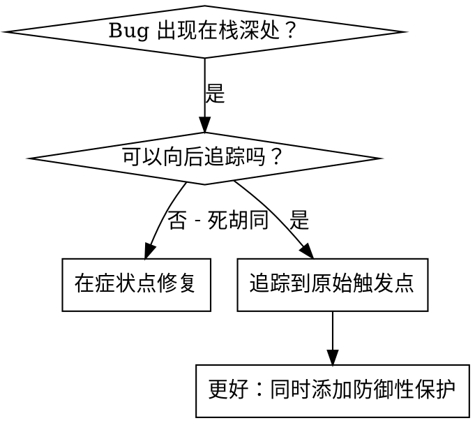
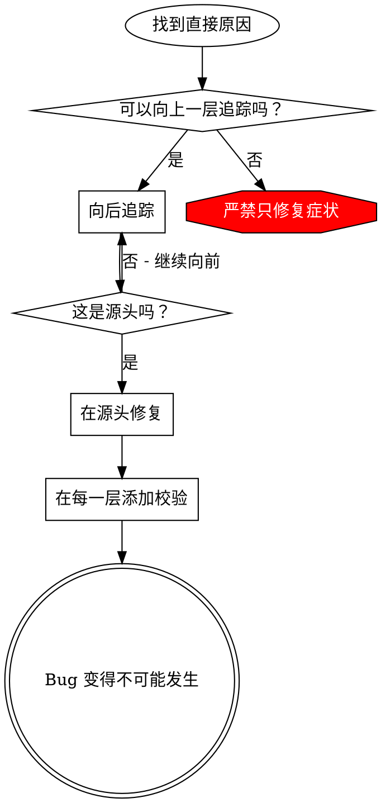

# 根本原因追踪 (Root Cause Tracing)

## 概览

Bug 通常出现在调用栈的深处（例如：在错误的目录初始化 git、在错误的位置创建文件、使用错误的路径打开数据库）。你的本能反应是在错误出现的地方进行修复，但那仅仅是在针对症状进行治疗。

**核心原则：** 沿着调用链向后追踪，直到找到原始触发点，然后在源头进行修复。

## 何时使用



**在以下情况下使用：**
- 错误发生在执行过程的深处（而非入口点）
- 堆栈跟踪（Stack trace）显示了很长的调用链
- 不清楚无效数据的来源
- 需要找出是哪个测试/代码触发了该问题

## 追踪流程

### 1. 观察症状
```
Error: git init failed in /Users/jesse/project/packages/core
```

### 2. 找到直接原因
**哪段代码直接导致了此结果？**
```typescript
await execFileAsync('git', ['init'], { cwd: projectDir });
```

### 3. 提问：谁调用了这个？
```typescript
WorktreeManager.createSessionWorktree(projectDir, sessionId)
  → 由 Session.initializeWorkspace() 调用
  → 由 Session.create() 调用
  → 由测试中的 Project.create() 调用
```

### 4. 持续向上追溯
**传递的值是什么？**
- `projectDir = ''`（空字符串！）
- 将空字符串作为 `cwd` 会解析为 `process.cwd()`
- 那就是源码目录！

### 5. 找到原始触发点
**空字符串是从哪里来的？**
```typescript
const context = setupCoreTest(); // 返回 { tempDir: '' }
Project.create('name', context.tempDir); // 在 beforeEach 运行之前就被访问了！
```

## 添加堆栈跟踪 (Stack Traces)

当你无法手动追踪时，可以添加诊断代码：

```typescript
// 在出现问题的操作之前
async function gitInit(directory: string) {
  const stack = new Error().stack;
  console.error('DEBUG git init:', {
    directory,
    cwd: process.cwd(),
    nodeEnv: process.env.NODE_ENV,
    stack,
  });

  await execFileAsync('git', ['init'], { cwd: directory });
}
```

**关键点：** 在测试中使用 `console.error()`（不要用 logger —— logger 的输出可能会被屏蔽）

**运行并捕获：**
```bash
npm test 2>&1 | grep 'DEBUG git init'
```

**分析堆栈跟踪：**
- 查找测试文件名
- 找到触发调用的行号
- 识别模式（相同的测试？相同的参数？）

## 找出哪个测试导致了“污染”

如果问题在测试期间出现，但你不知道是哪个测试导致的：

使用本目录下的二分查找脚本 `find-polluter.sh`：

```bash
./find-polluter.sh '.git' 'src/**/*.test.ts'
```

该脚本将逐个运行测试，并在第一个“污染源”处停止。用法请参见脚本说明。

## 真实案例：空 projectDir

**症状：** `.git` 在 `packages/core/`（源码目录）中被创建。

**追踪链：**
1. `git init` 在 `process.cwd()` 中运行 ← 空的 cwd 参数
2. `WorktreeManager` 被调用且 `projectDir` 为空
3. `Session.create()` 被传递了空字符串
4. 测试在 `beforeEach` 之前访问了 `context.tempDir`
5. `setupCoreTest()` 最初返回 `{ tempDir: '' }`

**根本原因：** 顶层变量初始化访问了空值。

**修复：** 将 `tempDir` 改为 getter 属性，如果在 `beforeEach` 之前访问则抛出错误。

**同时添加了防御性保护：**
- 第 1 层：`Project.create()` 校验目录合法性
- 第 2 层：`WorkspaceManager` 校验不为空
- 第 3 层：`NODE_ENV` 守卫拒绝在测试期间于 tmp 目录之外执行 `git init`
- 第 4 层：在 `git init` 之前记录堆栈跟踪日志

## 核心原则



**严禁只在错误出现的地方进行修复。** 必须向后追溯以找到原始触发源。

## 堆栈跟踪小贴士

**测试中：** 使用 `console.error()` 而不是 logger —— 某些环境可能屏蔽 logger 输出。
**操作前：** 在危险操作之前记录日志，而不是在失败后。
**包含上下文：** 目录、cwd（当前工作目录）、环境变量、时间戳。
**捕获堆栈：** `new Error().stack` 显示完整的调用链。

## 实际影响

来自某次调试会话 (2025-10-03)：
- 通过 5 层追踪找到了根本原因
- 在源头进行了修复（通过 getter 校验）
- 添加了 4 层防御逻辑
- 1847 个测试全部通过，零污染
