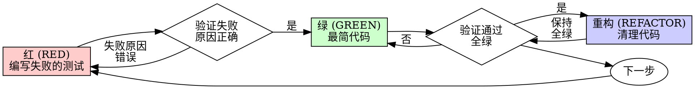

# 测试驱动开发 (TDD)

## 概览

先写测试。观察它失败。编写最简代码使之通过。

**核心原则：** 如果你没有亲眼看到测试失败，你就不知道它是否测试了正确的东西。

**违反规则的形式就是违反规则的精神。**

## 何时使用

**始终使用：**
- 新特性开发
- Bug 修复
- 代码重构
- 行为变更

**例外情况（需询问你的类比伙伴）：**
- 随手抛的原型代码
- 自动生成的代码
- 配置文件

产生“就这一次不搞 TDD”的想法了？停下。那是借口。

## 铁律

```
在没有先写出一个失败的测试之前，严禁编写任何生产环境代码。
```

在测试之前写了代码？删掉它。重新开始。

**绝无例外：**
- 不要把它留作“参考”
- 不要一边写测试一边“适配”它
- 不要看它一眼
- 删掉就是删掉

从测试开始重新实现。就这么简单。

## 红-绿-重构 (Red-Green-Refactor)



### 红 (RED) - 编写失败的测试

编写一个最小化的测试，展示预期的行为。

<正确示例>
```typescript
test('重试失败操作 3 次', async () => {
  let attempts = 0;
  const operation = () => {
    attempts++;
    if (attempts < 3) throw new Error('fail');
    return 'success';
  };

  const result = await retryOperation(operation);

  expect(result).toBe('success');
  expect(attempts).toBe(3);
});
```
名称清晰，测试真实行为，只测一件事。
</正确示例>

<错误示例>
```typescript
test('重试逻辑有效', async () => {
  const mock = jest.fn()
    .mockRejectedValueOnce(new Error())
    .mockRejectedValueOnce(new Error())
    .mockResolvedValueOnce('success');
  await retryOperation(mock);
  expect(mock).toHaveBeenCalledTimes(3);
});
```
名称模糊，测试的是 Mock 对象而非真实代码逻辑。
</错误示例>

**要求：**
- 单一行为
- 名称清晰
- 真实代码（除非万不得已，否则不要使用 Mock）

### 验证红 (Verify RED) - 观察其失败

**强制性要求。严禁跳过。**

```bash
npm test path/to/test.test.ts
```

确认：
- 测试失败（而不是由于语法错误导致报错）
- 失败信息符合预期
- 失败原因是特性缺失（而不是拼写错误）

**测试通过了？** 说明你在测试既有的行为。修正测试。

**测试报错了？** 修正错误，重新运行直到它以正确的方式失败。

### 绿 (GREEN) - 编写最简代码

编写最简单的代码使测试通过。

<正确示例>
```typescript
async function retryOperation<T>(fn: () => Promise<T>): Promise<T> {
  for (let i = 0; i < 3; i++) {
    try {
      return await fn();
    } catch (e) {
      if (i === 2) throw e;
    }
  }
  throw new Error('unreachable');
}
```
恰好足够通过测试。
</正确示例>

<错误示例>
```typescript
async function retryOperation<T>(
  fn: () => Promise<T>,
  options?: {
    maxRetries?: number;
    backoff?: 'linear' | 'exponential';
    onRetry?: (attempt: number) => void;
  }
): Promise<T> {
  // YAGNI (你还不需要它)
}
```
过度工程。
</错误示例>

不要添加额外功能，不要重构其他代码，不要进行超出测试要求的“改进”。

### 验证绿 (Verify GREEN) - 观察其通过

**强制性要求。**

```bash
npm test path/to/test.test.ts
```

确认：
- 测试通过
- 其他测试依然通过
- 输出整洁（无错误，无警告）

**测试失败了？** 修正代码，而不是测试。

**其他测试失败了？** 立即修复。

### 重构 (REFACTOR) - 清理代码

仅在全绿之后：
- 消除重复
- 改进名称
- 提取助手函数

保持测试全绿。不要改变行为。

### 重复循环

为下一个特性编写下一个失败的测试。

## 优秀的测试

| 质量 | 优秀 | 糟糕 |
|---------|------|-----|
| **最小化** | 只测一件事。名称中有 "and"？拆分它。 | `test('验证邮箱和域名及空格')` |
| **清晰度** | 名称描述了行为 | `test('test1')` |
| **展示意图** | 演示了理想的 API 调用方式 | 掩盖了代码应该做什么 |

## 为什么先后顺序很重要

**“我会以后再写测试来验证它有效”**

在写完代码后编写的测试会立即通过。立即通过证明不了任何事：
- 可能测错了东西
- 可能测试的是实现细节而非行为
- 可能遗漏了你忘掉的边界情况
- 你从未见过它捕捉到任何 bug

先写测试强制你看到它失败，证明它确实在测试某些内容。

**“我已经对手动测试了所有的边界情况”**

手动测试是随意的。你以为你测了一切，但：
- 没有你测试过什么的记录
- 代码变更时无法重复运行
- 在压力之下容易遗漏情况
- “我试的时候它是好的” ≠ 全面

自动化测试是系统化的。它们每次都以同样的方式运行。

**“删掉 X 小时的工作是非常浪费的”**

沉没成本谬误。时间已经过去了。你现在的选择是：
- 删掉并按 TDD 重写（再花 X 小时，高度自信）
- 保留它并事后补测（30 分钟，低度自信，极可能有漏洞）

所谓的“浪费”是保留了你无法信任的代码。没有真实测试的运行代码就是技术债务。

**“TDD 过于教条，务实意味着灵活适配”**

TDD **就是**务实的：
- 在提交前发现 bug（比事后调试更快）
- 防止回归（测试能立即捕捉到破坏性的改动）
- 文档化行为（测试展示了如何使用代码）
- 支持重构（自由修改，测试能捕捉破坏）

“务实”的捷径 = 在生产环境调试 = 更慢。

**“事后测试也能达到同样的目标 —— 重要的是精神而非仪式”**

不。事后测试回答的是“这做了什么？”。TDD 回答的是“这应该做什么？”。

事后测试会受到你实现方式的偏见影响。你测试的是你构建出来的东西，而不是要求的。你验证的是你记得的边界情况，而不是被发现的。

TDD 强制在实现之前发现边界情况。事后测试验证的是你是否记得了一切（通常你并没有）。

事后补测 30 分钟 ≠ TDD。你获得了覆盖率，但失去了证明测试有效的证据。

## 常见借口与现实

| 借口 | 现实 |
|--------|---------|
| “太简单了，不需要测” | 简单的代码也会崩。测试只要 30 秒。 |
| “我以后会测” | 立即通过的测试证明不了任何事。 |
| “事后测试目标一致” | 事后测试 = “这做了什么？” TDD = “这应该做什么？” |
| “已经手动测过了” | 随意 ≠ 系统。没有记录，无法重跑。 |
| “删掉 X 小时太浪费” | 沉没成本谬误。保留未经验证的代码是技术债。 |
| “留着参考，先写测试” | 你会忍不住去适配它。那就成了事后测试。删除意味着删除。 |
| “需要先进行探索” | 没问题。丢掉探索代码，从 TDD 开始正式实现。 |
| “测试太难 = 设计不清” | 听听测试怎么说。难测的代码通常也难用。 |
| “TDD 会拖慢速度” | TDD 比调试快。务实 = 先写测试。 |
| “手动测更快” | 手动证明不了边界情况。每次变动你都得重测一遍。 |
| “现有的代码没测试” | 你正在改进它。为现有代码添加测试。 |

## 警示信号 —— 停止并重新开始

- 先写代码后写测试
- 实现完成后才写测试
- 测试立即通过
- 无法解释测试为什么失败
- 稍后才添加测试
- 找借口说“就这一次”
- “我已经手动测过了”
- “事后测试能达到同样的目的”
- “重在精神而非仪式”
- “留作参考”或“适配既有代码”
- “已经花了 X 小时，删掉太可惜”
- “TDD 太教条，我很务实”
- “这个项目有所不同，因为……”

**所有这些都意味着：删掉代码。从 TDD 开始重新开始。**

## 示例：Bug 修复

**Bug：** 接受了空的邮箱地址

**红 (RED)**
```typescript
test('拒绝空邮箱', async () => {
  const result = await submitForm({ email: '' });
  expect(result.error).toBe('邮箱必填');
});
```

**验证红 (Verify RED)**
```bash
$ npm test
FAIL: expected '邮箱必填', got undefined
```

**绿 (GREEN)**
```typescript
function submitForm(data: FormData) {
  if (!data.email?.trim()) {
    return { error: '邮箱必填' };
  }
  // ...
}
```

**验证绿 (Verify GREEN)**
```bash
$ npm test
PASS
```

**重构 (REFACTOR)**
如果需要，为多个字段提取通用的验证逻辑。

## 验证检查清单

在标记任务完成之前：

- [ ] 每个新函数/方法都有测试。
- [ ] 在实现之前亲眼看到每个测试失败。
- [ ] 每个测试失败的原因都符合预期（特性缺失而非拼写错误）。
- [ ] 编写了最简代码使每个测试通过。
- [ ] 所有测试全部通过。
- [ ] 输出整洁（无错误、无警告）。
- [ ] 测试使用的是真实代码（除非万不得已才使用 Mock）。
- [ ] 覆盖了边界情况和错误处理。

无法勾选所有选项？说明你跳过了 TDD。重新开始。

## 遇到困难时

| 问题 | 解决方案 |
|---------|----------|
| 不知道怎么测 | 编写理想的 API 接口。先写断言。询问你的类比伙伴。 |
| 测试太复杂 | 设计太复杂。简化接口。 |
| 必须 Mock 一切 | 代码耦合度太高。使用依赖注入。 |
| 测试设置太庞大 | 提取助手函数。依然复杂？简化设计。 |

## 调试集成

发现 Bug？编写对应的失败测试来重现它。遵循 TDD 循环。测试能证明修复方案有效并防止回归。

**严禁在没有测试的情况下修复 Bug。**

## 测试反面模式

当添加 Mock 或测试实用程序时，阅读 `@testing-anti-patterns.md` 以避免常见陷阱：
- 测试 Mock 行为而非真实行为
- 在生产类中添加仅供测试的方法
- 在不理解依赖关系的情况下使用 Mock

## 终极原则

```
生产逻辑代码 → 必须存在测试且测试先失败过
否则 → 这不是 TDD
```

未经你的类比伙伴许可，不得有例外。
