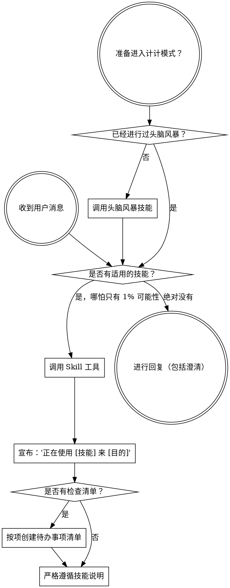

<SUBAGENT-STOP>
如果你作为子代理（subagent）被派去执行特定任务，请跳过此技能。
</SUBAGENT-STOP>

<EXTREMELY-IMPORTANT>
如果你认为某个技能有 1% 的可能性适用于你正在做的事情，你**绝对必须**调用该技能。

如果某个技能适用于你的任务，你别无选择，**必须使用它**。

这是不可商议的。这不是可选的。你不能找借口推脱。
</EXTREMELY-IMPORTANT>

## 指令优先级

超级能力（Superpowers）技能会覆盖默认的系统提示词行为，但**用户指令始终优先**：

1. **用户的明确指令** (CLAUDE.md, GEMINI.md, AGENTS.md, 直接请求) —— 最高优先级
2. **超级能力技能** —— 在冲突时覆盖默认系统行为
3. **默认系统提示词** —— 最低优先级

如果 CLAUDE.md、GEMINI.md 或 AGENTS.md 说“不要使用 TDD”，而某个技能说“始终使用 TDD”，请遵循用户的指令。用户拥有控制权。

## 如何访问技能

**在 Claude Code 中：** 使用 `Skill` 工具。当你调用一个技能时，它的内容会被加载并呈现给你——请直接遵循它。切勿对技能文件使用 Read 工具。

**在 Gemini CLI 中：** 通过 `activate_skill` 工具激活技能。Gemini 在会话开始时加载技能元数据，并根据需要激活完整内容。

**在其他环境中：** 请查看你平台的文档以了解技能是如何加载的。

## 平台适配

技能使用 Claude Code 的工具名称。非 CC 平台：请参阅 `references/codex-tools.md` (Codex) 以获取等效工具。Gemini CLI 用户通过 GEMINI.md 自动加载工具映射。

# 使用技能

## 规则

**在进行任何回复或动作之前，调用相关或要求的技能。** 哪怕只有 1% 的机会适用，也意味着你应该调用技能进行检查。如果调用的技能最终证明不适合当前情况，你不需要使用它。

## 警示信号 (Red Flags)

如果你产生了以下想法，说明你在找借口，请立即停止：

| 想法 | 现实 |
|---------|---------|
| “这只是个简单的问题” | 问题即任务。请检查技能。 |
| “我需要先了解更多上下文” | 技能检查应在提出澄清问题之前完成。 |
| “让我先探索一下代码库” | 技能会告诉你如何探索。请先检查。 |
| “我可以快速检查一下 git/文件” | 文件缺乏对话上下文。请检查技能。 |
| “让我先收集信息” | 技能会告诉你如何收集信息。 |
| “这不需要用到正式的技能” | 如果存在相关技能，请使用它。 |
| “我记得这个技能怎么用” | 技能在不断演进。请阅读当前版本。 |
| “这不算是一个任务” | 动作 = 任务。请检查技能。 |
| “用技能太小题大做了” | 简单的事情会变复杂。请使用它。 |
| “我就先做这一件事” | 在做任何事之前先检查。 |
| “这感觉效率很高” | 不守纪律的动作会浪费时间。技能可以防止这种情况。 |
| “我知道那是什么意思” | 知道概念并不等于使用了技能。请调用它。 |

## 技能优先级

当多个技能可能适用时，请遵循以下顺序：

1. **首先是流程类技能** (头脑风暴, 调试) —— 这些决定了如何处理任务
2. **其次是实现类技能** (前端设计, mcp-builder) —— 这些指导具体执行

“让我们构建 X” → 先头脑风暴，然后是实现技能。
“修复此漏洞” → 先调试，然后是特定领域的技能。

## 技能类型

**严格的** (TDD, 调试): 必须严格遵循。不要为了方便而放弃纪律。

**灵活的** (模式): 根据上下文调整原则。

技能本身会告诉你它属于哪一类。

## 用户指令

指令说明了“做什么”，而不是“怎么做”。“添加 X”或“修复 Y”并不意味着可以跳过工作流。
